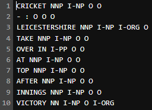
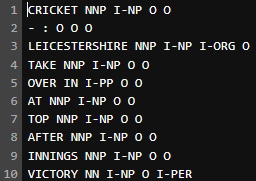

# Named Entity Recognition (NER) Tagger

## Overview

This is a personal side project where I built a Named Entity Recognition (NER) system from scratch to identify entities like people, locations, and organizations in text. I wanted to dive into both linear and neural models, so I implemented a BIO tagger using a Perceptron-based linear model and a BiLSTM-CRF neural model. The project uses the CoNLL 2003 dataset and explores cool techniques like Viterbi decoding, feature engineering, and character-level CNN embeddings—all coded up in Python with a mix of NumPy and PyTorch.

## What It Does

The goal was to tag words in sentences with labels like `I-PER` (inside a person’s name), `I-LOC` (inside a location), `I-ORG` (inside an organization), or `O` (outside any entity). I played around with two approaches:
- **Linear Model**: A Perceptron-based tagger with hand-crafted features, trained with Stochastic Subgradient Descent (SSGD) and Adagrad.
- **Neural Model**: A BiLSTM-CRF setup with word and character embeddings, trained with minibatching and log loss.

The system reads a four-column input file (token, POS tag, chunk tag, gold NE tag), ignores the gold tags during prediction, and outputs a new file with my predicted tags in a fifth column.

## Features

### Linear Model
- **Feature Set**:
  - Current word (e.g., `Wi=France+Ti=I-LOC`).
  - Previous tag (e.g., `Ti-1=<START>+Ti=I-LOC`).
  - POS tag (e.g., `Pi=NNP+Ti=I-LOC`).
  - Word shape (e.g., `Si=Aaaaaa+Ti=I-LOC` for "France").
  - Prefixes of length 1-4 (e.g., `PREi=Fr+Ti=I-LOC`).
  - Gazetteer check (e.g., `GAZi=True+Ti=I-LOC`).
  - Capitalization (e.g., `CAPi=True+Ti=I-LOC`).
- **Training**: Used Perceptron with SSGD and Adagrad, step size 1, no regularization.
- **Decoding**: Built a Viterbi decoder to find the best tag sequence.

### Neural Model
- **BiLSTM-CRF**: A bidirectional LSTM with a Conditional Random Field layer for sequence tagging.
- **Character CNN**: Added a CNN with max-pooling to capture character-level patterns (e.g., for "France", it learns from "F-r-a-n-c-e").
- **Training**: Minibatch training with log loss, optimized via the forward algorithm.
- **Decoding**: Reused the Viterbi decoder for prediction.

## Technical Details
- **Languages**: Python
- **Libraries**: NumPy (linear model), PyTorch (neural model), torchtext (data preprocessing)
- **Dataset**: CoNLL 2003 (four-column format: token, POS, chunk, NE tag)
- **Models**:
  - Linear: Structured Perceptron with SSGD and Adagrad.
  - Neural: BiLSTM-CRF with character CNN embeddings.

## Setup Instructions
1. **Clone the Repository**:
```bash
git clone https://github.com/alexliu0121/NER-Tagger.git
cd NER-Tagger
```

2. **Install Dependencies**:
```bash
pip install numpy torch torchtext
```

3. **Download Data**: Grab the CoNLL 2003 dataset (e.g., `train.txt`, `dev.txt`, `test.txt`) and place it in a `data/` folder.
4. **Run the Models**:
- Linear Model:
```bash
python linear_ner.py --train data/train.txt --dev data/dev.txt --test data/test.txt
```
- Neural Model:
```bash
python neural_ner.py --train data/train.txt --dev data/dev.txt --test data/test.txt
```


## Usage
- Feed it a CoNLL-formatted file (e.g., `data/dev.txt`).
- The script outputs a new file with predicted tags (e.g., `dev_output.txt`).
- Check the `results/` folder for performance metrics and sample outputs.

## Performance Highlights
- **Linear Model (Basic Features, SSGD)**:
- Dev: Precision 29.8%, Recall 36.2%, F1 31.45
- Test: Precision 23.7%, Recall 29.78%, F1 26.67
- **Linear Model (Full Features, Adagrad)**:
- Dev: Precision 36.87%, Recall 47.64%, F1 41.57
- Test: Precision 30.53%, Recall 41.86%, F1 35.31
- **Neural Model (BiLSTM-CRF + CNN)**:
- Dev: Precision 73.03%, Recall 71.4%, F1 72.13
- Test: Precision 65.51%, Recall 60.66%, F1 62.86

## Showcase
Here’s a peek at how the tagger performs. Images below show sample outputs:

  
*Caption: Sample tagging with basic features (SSGD) on dev set.*

  
*Caption: BiLSTM-CRF with CNN tagging on test set.*

  
*Caption: Top and bottom feature weights from the linear model.*


## What I Learned
- **Feature Engineering**: Crafting features like word shape and prefixes was tricky but taught me how small tweaks can boost performance.
- **Viterbi Decoding**: Implementing it for both models was a fun challenge—getting the backpointers right felt like solving a puzzle.
- **Neural Magic**: Adding the character CNN to the BiLSTM-CRF was a game-changer, jumping the F1 score way up.
- **Error Analysis**: Digging into mistakes (e.g., "Grace Road" as `I-PER` instead of `I-LOC`) showed me how training data biases shape predictions.

## Observations
- The linear model struggled with entity types (e.g., mixing up "Grace" as a person vs. location) but nailed orgs like "Surrey" thanks to sports team patterns in the data.
- The full feature set didn’t fix everything but stabilized training. Feature weights revealed biases—like disfavoring "Newcastle" as `I-PER` despite its location roots.
- The neural model crushed it, fixing most errors, though it still tripped on ambiguous cases like "Kent."

## Next Steps
- Tweak the CNN padding to handle rare words better.
- Experiment with alternative loss functions (e.g., SVM loss) for the neural model.
- Add a bigger gazetteer to boost the linear model’s accuracy.
